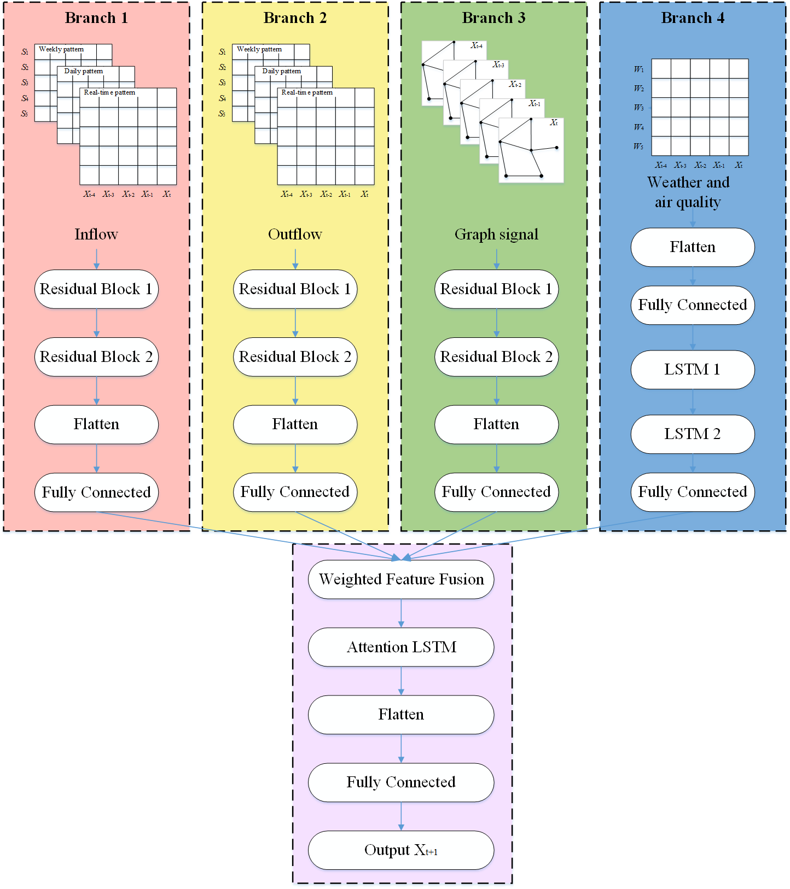

# a PyTorch version for ResLSTM

### Introduction

a PyTorch version for the work [ResLSTM(ResNet+LSTM+GCN)](https://github.com/JinleiZhangBJTU/ResNet-LSTM-GCN.git)

Thanks to the writer [Jinlei Zhang](https://github.com/JinleiZhangBJTU). It's a very great work.



### Structure

adjacency.csv: the graph signal

data/inflowdata: Inflow

data/meteorology: Weather and air quality

data/outflowdata: Outflow

load_data.py: load the upper data

metrics.py: evaluate

ResLSTM_t.py: PyTorch version of the model

ResLSTM.py: raw version of the model

### How to Run

```
python ResLSTM_t.py
```

### Reference

J. Zhang, F. Chen, Z. Cui, Y. Guo and Y. Zhu, "[Deep Learning Architecture for Short-Term Passenger Flow Forecasting in Urban Rail Transit](http://doi.org/10.1109/TITS.2020.3000761)," in IEEE Transactions on Intelligent Transportation Systems, doi: 10.1109/TITS.2020.3000761.

Raw version(Tensorflow and Keras): https://github.com/JinleiZhangBJTU/ResNet-LSTM-GCN.git

### Other

The author is very busy this time, about the requirements and some other stuff I will keep it up sometime.
